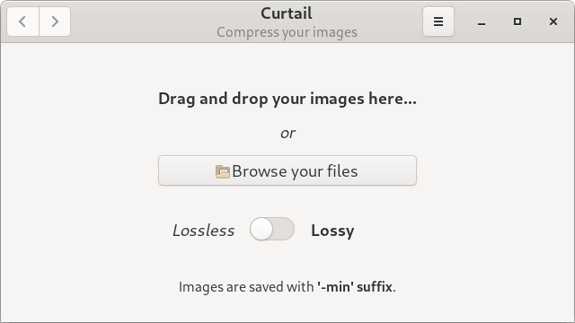

# Curtail

## Compress your images

Curtail (previously ImCompressor) is an useful image compressor, supporting PNG and JPEG file types.
It support both lossless and lossy compression modes with an option to whether keep or not metadata of images.
It is inspired by [Trimage](https://github.com/Kilian/Trimage) and [Image-Optimizer](https://github.com/GijsGoudzwaard/Image-Optimizer).

### Supported formats

PNG, JPEG

## Screenshot

## Installation instructions

### Universal package for Linux (recommended)

Curtail is available as a flatpak package.

You can also install it by using the following command-line:

    flatpak install flathub com.github.huluti.Curtail
    
### Distro packages

    
### Build from source (nightly)

Build and install by running:

    git clone https://github.com/Huluti/Curtail.git
    cd Curtail
    meson _build
    cd _build
    ninja
    sudo ninja install

The app can then be removed with:

    sudo ninja uninstall

## Tech

Curtail uses a number of open source projects to work properly:

- [GTK 3](https://www.gtk.org)
- [Python 3](https://www.python.org)
- [OptiPNG](http://optipng.sourceforge.net)
- [pngquant](https://pngquant.org)
- [Jpegoptim](https://github.com/tjko/jpegoptim)

## Donations

Do you like the app? Would you like to support its development? Feel free to donate.

## License

GNU GENERAL PUBLIC LICENSE (v3)

**Free Software, Hell Yeah!**
